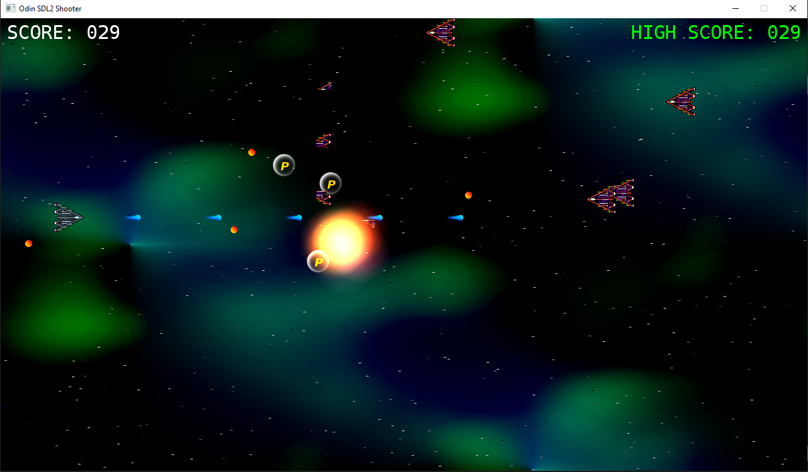

# SDL2 Shoot 'em up (Odin Port)



This project aims to be a **1:1 port** from C to Odin of a classic "2D Shoot 'em up".

## Purpose

The primary goal of this repository is **educational**.

 I created this project as a learning exercise to better understand the Odin programming language. The code is organized as a direct, structure-preserving translation of the original C source by Parallel Realities.

**Note:** This code does *not* follow idiomatic Odin best practices. Instead, it intentionally preserves the logic, data structures, and flow of the original C implementation. This makes it easier to compare both versions side by side and understand how C constructs translate into Odin.

## Credits

A huge thank you to **Parallel Realities** for creating such an excellent and comprehensive set of tutorials.
You can find the original C-based tutorials and information on where to get the original C source code here:
https://www.parallelrealities.co.uk/tutorials/#shooter

## Prerequisites

To build and run this project, you will need:

* The Odin compiler installed and available in your `PATH`
* SDL2 (see note below)

> **Note:** Odin provides SDL2 bindings and prebuilt libraries under its `vendor` directory.
> If your Odin installation includes SDL2 support, no additional setup may be required.
> Otherwise, you will need to install SDL2 development libraries manually.

## Getting Started

1. Clone this repository
2. Install the required SDL2 dependencies for your platform
3. Run the project:

```bash
odin run .
```

## Debugging

If you want to debug the project, I personally recommend RAD Debugger (THE debugger).

It has been used extensively during development to inspect execution flow, track down bugs, and better understand how the translated code behaves compared to the original C version.

You can find it here:
https://github.com/EpicGamesExt/raddebugger

## Platform Notes

Tested on:

* Windows 10

## Notes

* This is a learning project, not a production-ready codebase
* Expect C-style patterns rather than idiomatic Odin
* The goal is clarity and comparison, not optimization
* Future improvements may include a refactored and a more idiomatic Odin version

## License

This project is licensed under the MIT License.

However, it's a direct Odin port of the original C tutorials by Parallel Realities:
https://www.parallelrealities.co.uk/tutorials/

All credit for the original design and implementation belongs to Parallel Realities.
This repository is intended for educational purposes only.
